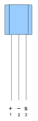

# RocNetNode

### GCA Übersicht
* <a href="https://wiki.rocrail.net/doku.php?id=gca:gca-index-de" target="_blank">Preise</a>
* <a href="https://wiki.rocrail.net/doku.php?id=%3Agca%3Agca-orderform-de" target="_blank">Bestellformular</a>
* <a href="https://wiki.rocrail.net/lib/exe/fetch.php?cache=&media=gca:gca_raspi_overview_1.png" target="_blank">Anschlussbeispiel 1</a>

### PI01 <a href="https://wiki.rocrail.net/doku.php?id=gca1-pi01-de" target="_blank">(Dokulink)</a>
Der PI01 wird auf einen Raspi aufgesteckt und dient als Zentrale zu PI02 usw.  
An einem Raspi können 4 PI02 und 8 PI03 parallel betrieben werden.  
**Evtl. nochmal im Forum nachfragen!**

##### Stromversorgung
Jumper drauf setzen, wenn der Strom über PI06 kommt!  
**Achtung!** Raspi kann zerstört werden.

##### Taster
Wird PB1 für länger als 5 Sek. gedrückt, wird das RocNet-Programm auf dem Raspberry Pi abgebrochen.

---
### PI02  <a href="https://wiki.rocrail.net/doku.php?id=gca_pi02-de" target="_blank">(Dokulink)</a>
Pro PI02 können 32 Ein-/Ausgang-Leitungen geschaltet werden.  
Es können 4 PI02 mit einem Raspi betrieben werden. Das bedeutet pro Raspi sind 128 I/O möglich.  

##### Stromversorgung
Jumper drauf setzen, wenn der Strom über PI06 kommt!  
**Achtung!** Raspi kann zerstört werden.

##### Jumper Adressauswahl
Platine # | dip 1 | dip 2 | I/O-Ports | I2C-Adresse
:-------: | :---: | :---: | :-------: | :---------:
1 | off | off | 1..32   | 0×20-0×21
2 | off | on  | 33..64  | 0×22-0×23
3 | on  | off | 65..96  | 0×24-0×25
4 | on  | on  | 97..128 | 0×26-0×27

---
### PI03 <a href="https://wiki.rocrail.net/doku.php?id=gca-pi03-de" target="_blank">(Dokulink)</a>
Pro PI03 kann 16 Ausgänge steuern.  
Jeder Ausgang kann für das Regeln eines Servo-Motors oder zur 0-100%-Einstellung der Leuchtstärke einer LED verwendet werden.   
Es können 8 PI03 an einen Raspi angeschlossen werden, also insgesamt sind 128 regelbare Ausgänge möglich.

##### Jumper Adressauswahl
dip 1 | dip 2 | Funktion
:---: | :---: | --------
OFF | OFF | keine Speisung nach Servos und I/O1,2
ON  | OFF | NICHT verwenden
OFF | ON  | 5V-Speisung für Servos muss über V5 angeschlossen werden 5V-Versorgung für I/O1,2 kommt von der RocNet Speisung
ON  | ON  | 5V-Speisung für Servos und I/O1,2 kommt von der RocNet Speisung

---
### PI06 <a href="https://wiki.rocrail.net/doku.php?id=gca-pi06-de" target="_blank">(Dokulink)</a>
Der PI06 wurde entwickelt, um wirklich stabile 5V 3A Leistung an einen RocNetNode-Aufbau zu liefern.  
Auf der Dokuseite sind die Problem ohne einen PI06 beschrieben.  
Das Verketten von einem PI02 oder PI03 zum nächsten möglich.
**Achtung!**  Schleifen vermeiden   
<a href="https://wiki.rocrail.net/lib/exe/detail.php?id=gca-pi06-de&media=gca:gca_raspi_overview_1.png" target="_blank">Beispiel Architektur</a>

---
### GCA173 <a href="https://wiki.rocrail.net/doku.php?id=gca173-de" target="_blank">(Dokulink)</a>
Signale von Hallsensoren werden gehalten und in ausreichender Dauer an den PI02 gemeldet.  
Der Sensor selbst wird in Rocrail als *Achs-Zähler* programmiert.  
Pendelzüge müssen mit mindestens zwei Magneten ausgerüstet sein, 
damit die Sensoren in beiden Richtungen arbeiten und dafür sorgen, dass der Zug beim ersten erkannten Magneten anhält.

##### Anschluss Hallsensor
Die Verbindungen zwischen Hallsensor und GCA173 dürfen bis zu 2 m lang sein.  
Aber bitte beachten, dass diese Verbindungen nicht parallel mit Schienen und deren Versorgungs-Leitungen installiert werden.
Geht es nicht anders, sollte wenigstens einen Abstand von 10 cm beachtet werden.
Wenn diese Verbindung etwas 'verdrillt' wird, werden jegliche Störungen vermieden.
Senkrechtes kreuzen ist kein Problem.  

##### Handhabung in Rocrail
Rocrail vergleicht die gezählten Wagen des Von- mit dem Nach-Block:  

* Wenn ein oder beide Blocks "null" melden, erfolgt kein Vergleich.  
* Normale Verarbeitung erfolgt im Fall, dass der Nach-Block einen gleichen oder höheren Zählwert als der Von-Block meldet.  
* Im Fall, dass der Nach-Block einen kleineren Zählwert als der Von-Block meldet, wird die Lok vom Automodus abgemeldet und der Von-Block wird geschlossen "closed".  
* Nach dem die verlorenen Wagen wieder an den Zug angehängt wurden, kann der Von-Block wieder aktiviert und die Lok im Automodus re-aktiviert werden.  
