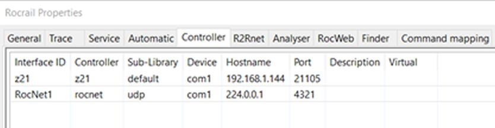

# RocView
* Installation auf Client
* Rocrail Server (Raspberry 192.68.1.140) hinzufügen
* Zentrale & RocNetNode hinzufügen: File -> RocRail Properties -> Tab Controller
  
* Beim PI01 unter Options->Hardware den Raspberry Pi Typ einstellen: Pi 1 = Erste Generation oder Pi 2 = Pi 2,3,4
