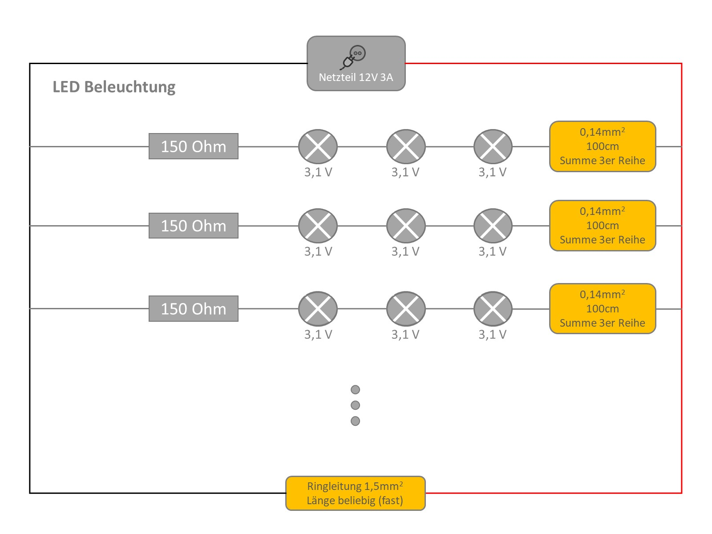

# Verkabelung
**Achtung! Bei Netzteilen mit mehr als 3A besteht ohne eine Sicherung Brandgefahr!**  

Mein Forumsbeitrag dazu mit vielen nützlichen Tipps: <a href="https://forum.rocrail.net/viewtopic.php?f=94&t=19416" target="_blank">Tipps Verkabelung & Stromversorgung</a>  

### Digitale Stromversorgung & Rocnet
##### Überblick

##### Infos
* Max. Länge I2C vom Raspi zum letzten PI 10m
* Hallsensor Zuleitung nicht direkt neben bzw. parallel zum Gleis
* Steckverbinder: PSK mit Stiftleisten
* Wegen Wartung überall Steckverbinder

### Statische LEDs
##### Überblick

##### Infos
Die Infos kommen von der Seite <a href="https://www.ledhilfe.de/viewtopic.php?t=5556" target="_blank">Reihen + Parallelschaltung von LEDs</a>

Als LEDs nehmen wir weiss 3,1V/20mA

Also gehen nur 3 LEDs in Reihe, macht 3*3,1V= 9,3V12V Eingangsspannung –9,3V für die LEDs=2,7V. Die 2,7V müssen jetzt von dem Vorwiderstandvernichtet werden. 2,7V wird geteilt durch die 20mA die die LED verbraucht ergibt einenWiderstand von 135 Ohm.Da es einen solchen nicht gibt, nimmt man den nächst größeren Widerstand, das wären dann 150 Ohm.Natürlich kann man auch einen noch größeren Widerstand verwenden,was der LED-Lebensdauer zugute kommt. 180 Ohm ( einige nehmen sogar 220 Ohm) kann man durchaus auchnehmen. Die LED wird dadurch nicht merklich dunkler.Bleiben wir aber mal bei den 150 Ohm, dann fallen am Widerstand etwa 2,9V ab.

Wie bei einem Motor sollte auch ein NT nicht „auf der letzten Rille“ laufen.Eine Auslastung von ca 80%-85% sollte hier genügen.Die Rechnung sieht dann so aus.Angabe auf dem NT 500mA minus 20% = 400mA geteilt durch die mA der LED ergibt 20 Reihen.Da ja immer 3 LEDs in Reihe sind, das ganze mal 3 ergibt 60LEDs.
